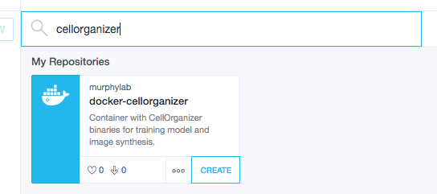

# docker-cellorganizer

[](https://travis-ci.org/icaoberg/docker-cellorganizer)
[](https://github.com/icaoberg/docker-cellorganizer/issues)
[](https://github.com/icaoberg/docker-cellorganizer/network)
[](https://github.com/icaoberg/docker-cellorganizer/stargazers)
[](https://www.gnu.org/licenses/quick-guide-gplv3.en.html)

## About CellOrganizer 


The [CellOrganizer](http://cellorganizer.org/) project provides tools for

* learning generative models of cell organization directly from images
* storing and retrieving those models
* synthesizing cell images (or other representations) from one or more models

Model learning captures variation among cells in a collection of images. Images used for model learning and instances synthesized from models can be two- or three-dimensional static images or movies.

[CellOrganizer](http://cellorganizer.org/) can learn models of

* cell shape
* nuclear shape
* chromatin texture
* vesicular organelle size, shape and position
* microtubule distribution.

These models can be conditional upon each other. For example, for a given synthesized cell instance, organelle position is dependent upon the cell and nuclear shape of that instance.

Cell types for which generative models for at least some organelles have been built include human HeLa cells, mouse NIH 3T3 cells, and Arabidopsis protoplasts. Planned projects include mouse T lymphocytes and rat PC12 cells.

### CellOrganizer Releases

#### CellOrganizer v2.7.0

##### Features

* Included new model class/type:constructive_geometry/half-ellipsoid
* Included new model class/type: framework/pca
* Included support for OME.TIFF with regions of interest
* Included bash scripts to run demos from compiled versions of the main functions

##### Enhancements

* img2slml now checks the combination of model class and type for every submodel before attempting to extract parameters from image 
* Improved pipeline so that CellOrganizer will stop computation and report to user if no images are found in the path or if software fails to extract parameters.
* Added demo3D44 to show how to synthesize from a model class/type constructive_geomertry/half-ellipsoid
* Added a battery of unit test for demos using Matlab testing framework
* Added demo3D45 to show how to use OME.TIFF files with ROIs.
* Added demo2D05, demo2D06, demo2D07 to show how to train and synthesize from a classtype framework/pca model

##### Release Highlights

#### CellOrganizer v2.6.0

##### Release Highlights

* SBML Spatial 3 Level 1 draft 0.90 support. Included a new synthesis output option named 'SBMLSpatial' that saves a synthetic image as an SBML instance.
* OME-TIFF support. Included a new synthesis output options named 'OMETIFF' that saves a synthetic image as an OME-TIFF Bioformats.
* T cell models. Included a new model class/type called standardized_voxels/standardized-map half-ellipsoid which is used to model the protein distribution of T cell movies, given annotations of the synapse.

## Docker

### Installing Docker

Installing Docker is beyond the scope of this document. To learn about Docker Community Edition (CE), click [here](https://www.docker.com/community-edition).

* To install Docker-for-Mac, click [here](https://docs.docker.com/docker-for-mac/install/).
* To install Docker-for-Windows, click [here](https://docs.docker.com/docker-for-windows/install/).

### Installing Kitematic

The easiest way to download an image and run a container is to use [Kitematic(https://kitematic.com/).

* To install Kitematic, click [here](https://kitematic.com/docs/).

### About the Docker container

#### Downloading image and running container using Kitematic

Running Kitematic will open a window that looks like this


Use the searchbar to search for `cellorganizer`



and click `Create`.

#### Downloading image and running container


To build an image using the `Dockerfile` in this repository, run the command

```
➜ docker build -t "murphylab/cellorganizer" .
```

The previous step should build an image

```
➜  docker container ls -a

CONTAINER ID        IMAGE               COMMAND                  CREATED             STATUS                        PORTS               NAMES
48dde52f2bc8        murphylab/cellorganizer     "/bin/bash -c 'pyt..."   45 seconds ago      Exited (0) 39 seconds ago                         frosty_wescoff
```

To run a container using the image above

```
➜  docker run -i -t murphylab/cellorganizer
```

#### Installed Tools

The container comes with

* CellOrganizer binaries
* [Generative models](http://www.cellorganizer.org/model_repository/)
* [Murphy Lab 2D/3D HeLa datasets](http://murphylab.web.cmu.edu/data/)
* [BioFormats tools](https://downloads.openmicroscopy.org/bio-formats/)
* [vim-as-an-IDE](https://github.com/icaoberg/vim-as-an-ide)

---

Support for [CellOrganizer](http://cellorganizer.org/) has been provided by grants GM075205, GM090033 and GM103712 from the [National Institute of General Medical Sciences](http://www.nigms.nih.gov/), grants MCB1121919 and MCB1121793 from the [U.S. National Science Foundation](http://nsf.gov/), by a Forschungspreis from the [Alexander von Humboldt Foundation](http://www.humboldt-foundation.de/), and by the [Freiburg Institute for Advanced Studies](http://www.frias.uni-freiburg.de/lifenet?set_language=en).

[](http://www.mmbios.org)

Copyright © 2007-2018 by the [Murphy Lab](http://murphylab.web.cmu.edu) at the [Computational Biology Department](http://www.cbd.cmu.edu) in [Carnegie Mellon University](http://www.cmu.edu)
